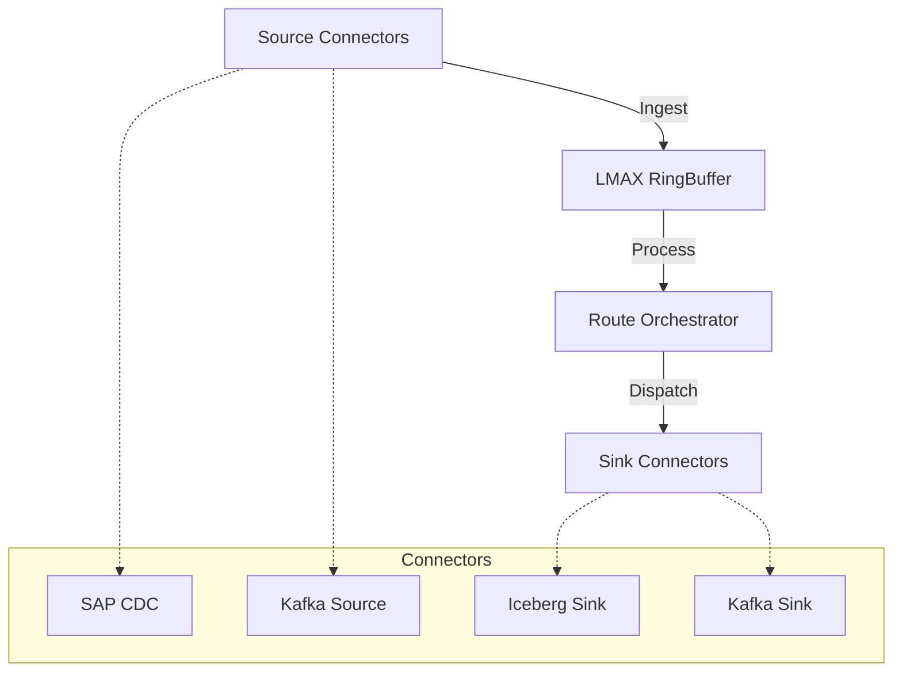

# Nobu Streaming Platform

> **High-Performance, Modular Event Streaming & Data Integration Platform**

Nobu is a next-generation event streaming platform built for low latency, high throughput, and seamless data integration. Built on **Quarkus** and leveraging the **LMAX Disruptor**, Nobu provides a robust backbone for real-time data pipelines, Change Data Capture (CDC), and Lakehouse ingestion.

## 🚀 Key Features

- **High Performance**: Uses LMAX Disruptor for ultra-low latency event processing.
- **Modular Architecture**: Pluggable Core, SPI, and Connector design.
- **Extensive Connectors**:
    - **Sources**: SAP CDC (JDBC, REST, Data Services), Kafka.
    - **Sinks**: Apache Iceberg (Lakehouse), Kafka, Google PubSub, Console, Logger.
- **Lakehouse Native**: Built-in support for streaming ingestion into Apache Iceberg tables with upsert/merge capabilities.
- **Cloud Native**: Designed for Kubernetes and serverless deployments via Quarkus (JVM and Native modes).

## 🏗️ Architecture

Nobu follows a clean, hexagonal architecture:



### Modules
- **`server`**: The core runtime, orchestration logic, and REST API.
- **`spi`**: Service Provider Interfaces for defining custom connectors.
- **`connectors`**: Implementation of various source and sink connectors.
    - `sap`: SAP HANA CDC (JDBC, REST, Data Services).
    - `lakehouse/iceberg`: Streaming ingestion to Iceberg tables.
    - `kafka`: Apache Kafka integration.
    - `pubsub`: Google Cloud Pub/Sub.

## 🛠️ Prerequisites

- **JDK 17+**: Required for building and running.
- **Maven 3.8+**: Build tool (bundled `mvnw` included).
- **Docker**: Required for running integration tests and Dev Services (Redpanda, MinIO).

## 🚦 Getting Started

### 1. Clone and Build

```bash
git clone https://github.com/nibustream/nobu.git
cd nobu
./mvnw clean install
```
> **Note**: This command automatically installs the proprietary SAP JDBC driver (`ngdbc.jar`) from the `lib/` directory into your local Maven repository.

### 2. Run in Dev Mode

Start the server with hot-reload enabled:

```bash
./mvnw quarkus:dev
```

This will:
- Start the Nobu server on port `8080`.
- Spin up Redpanda (Kafka) via Testcontainers/Dev Services.
- Enable the Dev UI at `http://localhost:8080/q/dev`.

## ⚙️ Configuration

Nobu is configured via `application.properties` for system settings and `route.yaml` for pipeline definitions.

### defining Routes (`route.yaml`)

Edit `server/src/main/resources/route.yaml` to define your data pipelines:

```yaml
connections:
  my_kafka:
    type: kafka
    impl: com.nobu.connect.kafka.KafkaConnector
    config:
      bootstrap.servers: localhost:9092

  my_console:
    type: console
    impl: com.nobu.connect.console.ConsoleConnector

routes:
  - id: debug_flow
    target: my_console
    config:
      prefix: "[DEBUG] "
```

### SAP Connector Configuration

The SAP CDC connector requires specific configuration.
> **Important**: The SAP connector is disabled by default in `route.yaml` to prevent startup errors if no HANA instance is available. Uncomment the `sap_cdc_jdbc` section to enable it.

```yaml
sources:
  sap_cdc_jdbc:
    type: sap-cdc-jdbc
    impl: com.nobu.connect.sap.jdbc.JdbcSapCdcConnector
    config:
      jdbc.url: jdbc:sap://hana-host:30015
      jdbc.user: ${SAP_USER}
      jdbc.password: ${SAP_PASSWORD}
      cdc.table: attrep_cdc_changes
```

## 🧊 Iceberg Lakehouse Ingestion

Nobu features a high-performance **Iceberg Sink** capable of streaming data directly into Data Lake tables.

- **WAL (Write-Ahead-Log)**: Ensures zero data loss using local LMDB buffering.
- **Primary Key Index**: Handles upserts and de-duplication automatically.
- **Compaction Aware**: Detects external compactions (e.g., from Spark) and updates indexes in real-time.

[Read the detailed Iceberg Sink Architecture](./iceberg.html)

## 🤝 Contributing

1. Fork the repository.
2. Create your feature branch (`git checkout -b feature/amazing-feature`).
3. Commit your changes (`git commit -m 'Add some amazing feature'`).
4. Push to the branch (`git push origin feature/amazing-feature`).
5. Open a Pull Request.

## 📄 License

This project is licensed under the Apache 2.0 License.
